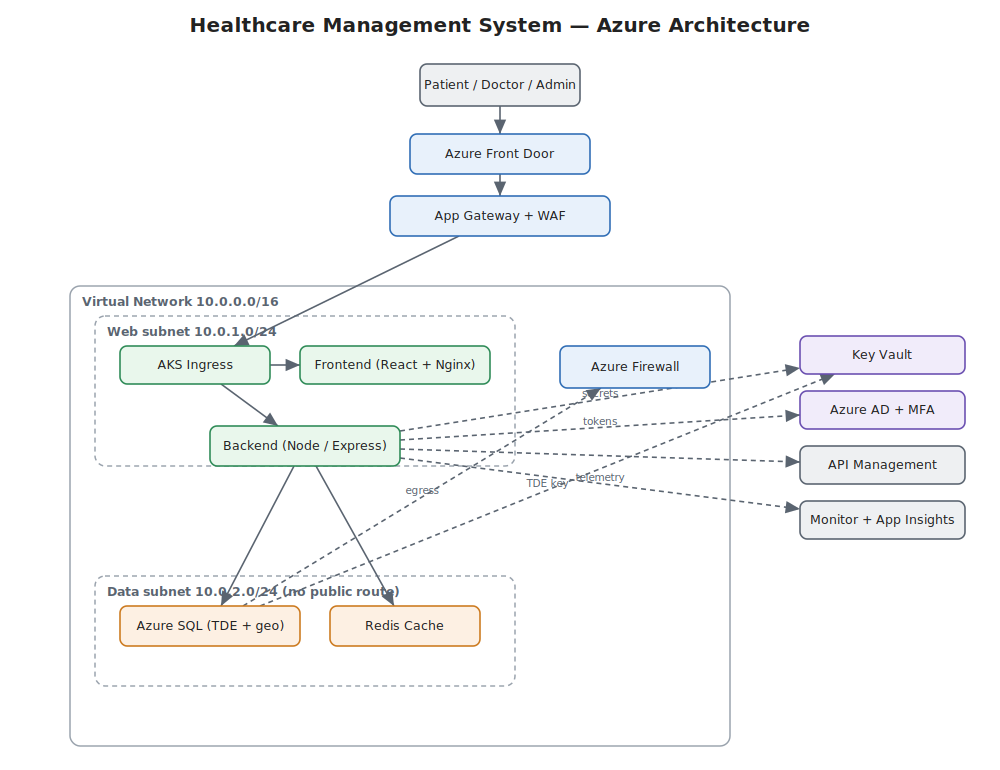
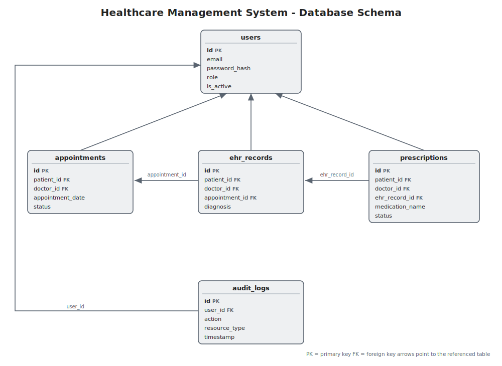

# Architecture

## The short version

It's a three-tier web app — React front end, Node/Express API, SQL database — wrapped in the Azure networking and security services the brief asks for. Nothing exotic. The interesting decisions are mostly about *where the boundaries are*: which subnet can talk to which, who's allowed to read a record, and what's encrypted.

## Diagram

The vector file is `docs/diagrams/architecture.svg` — it drops straight into PowerPoint 365 and stays sharp at any size. `architecture.png` is the same diagram as a raster, which is what goes into the Word report.

## Database schema

Five tables, and everything hangs off `users`. A patient and a doctor are both just rows in `users` with a different `role`; appointments, health records and prescriptions each point back to the patient and the doctor who created them, and every sensitive action gets written to `audit_logs`. The chain also runs sideways — a prescription is tied to the record it came from, which is tied to the appointment.

## How a request actually flows

Say a doctor opens a patient's record:

1. The browser hits **Front Door**, which terminates TLS and routes to the nearest healthy region.
2. **Application Gateway** runs the request through the **WAF** (OWASP rules — SQL injection, XSS, etc.) before it's allowed in.
3. It lands on the **AKS ingress**, which sends API calls to the backend pods and everything else to the frontend pods.
4. The backend checks the **JWT** on the request. The token was issued at login and carries the user's role. No valid token, no entry.
5. Assuming the token's good, the **RBAC layer** asks a simpler question: is a DOCTOR allowed to read this patient's EHR? Yes. Would a PATIENT be allowed to read *someone else's*? No, and that's enforced in the query itself, not just the route.
6. The backend reads from **Azure SQL** over a private connection inside the VNet. The data subnet has no public IP and no route to the internet except outbound through the firewall, so the database is simply not reachable from outside.
7. The read gets written to the **audit_logs** table (who, what, when, from which IP).
8. **App Insights** records the latency and any errors along the way.

## Why each service is here

I tried not to add things just because they were on the list. Here's the honest reasoning, including where a cheaper option exists.

**Virtual Network + subnets + NSGs** — the foundation. Splitting web and data into separate subnets lets me say "the database accepts connections from the web subnet and nothing else" as an actual rule. Free.

**Application Gateway with WAF** — this is the layer-7 front door for the app, and the WAF is what gives me the OWASP protection the compliance story needs. I'd keep this even on a tight budget.

**Azure Firewall** — central egress control for the whole VNet. It's the right tool at scale, but for a single small cluster the NSGs plus the WAF cover most of the threat model, so it's the first thing I'd treat as optional in a smaller deployment.

**Front Door** — global entry point and failover between regions. It's what makes the geo-replication actually useful, because it can flip traffic to the secondary region if the primary goes down.

**DDoS Protection** — Basic is on by default at the platform level. Standard is the heavyweight option, so I'd only turn it on if the client were actually being targeted or had a compliance clause demanding it.

**Azure AD + MFA + OAuth2/OIDC** — identity. Patients can sign in with OIDC; doctors and admins get MFA enforced. The app itself issues its own JWTs after Azure AD authenticates the user, which keeps the API stateless.

**Key Vault** — one place for secrets and for the key that encrypts the SQL database (TDE). The app pulls secrets at startup; nothing sensitive sits in a config file or an environment variable in source control.

**Azure SQL with TDE and geo-replication** — the system of record. TDE encrypts it at rest with a customer-managed key from Key Vault. Geo-replication keeps a warm copy in a second region for disaster recovery. In a smaller deployment I'd run Serverless and add the replica at launch.

**Redis Cache** — caches sessions and the handful of read-heavy queries (a doctor's appointment list, say). Takes load off SQL and makes the UI feel quick.

**API Management** — the front gate for the REST API: throttling, a consistent auth check, and a place to publish docs. In the local build I simulate the important parts (rate limiting, security headers) inside Express so the behaviour is the same even without paying for APIM.

**AKS + ACR** — Kubernetes runs the containers; ACR stores the images. AKS gives me the horizontal pod autoscaler for handling load spikes, and rolling deployments so an update doesn't take the app down.

**Monitor / Log Analytics / App Insights** — telemetry. Without it you're flying blind on performance and you can't prove uptime.

**Azure Policy + Advisor** — governance. Policy stops non-compliant resources being created (wrong region, oversized SKU, TDE turned off), and Advisor flags reliability and security improvements the design might have missed.

## Availability and scaling

- **No single point of failure in the app tier:** at least two pods each for frontend and backend, spread across availability zones, fronted by a load balancer.
- **Autoscaling:** the HPA (`kubernetes/hpa.yaml`) adds backend pods when CPU crosses ~70%, and the cluster autoscaler adds nodes if the pods need more room. Scales back down when the rush is over.
- **Database HA:** Azure SQL's tier already gives you a local replica; geo-replication adds the cross-region one. Front Door handles the failover routing.
- **Stateless backend:** because the API keeps no session state in memory (it's all in the JWT and Redis), any pod can serve any request, which is what makes the autoscaling safe.

## The local vs cloud difference, on purpose

The application logic runs unchanged in both places — the difference is the data driver and the surrounding services. Because the data access lives in one module (`backend/src/database.js`), moving to Azure SQL means swapping the `better-sqlite3` driver for an mssql one and pointing it at a Key Vault connection string, rather than editing every route. Here's what differs:

| Concern | Local demo | Azure production |
|---|---|---|
| Database | SQLite file | Azure SQL + TDE + geo-replica |
| Secrets | `.env` file | Key Vault |
| Rate limiting / WAF | express-rate-limit + Helmet | API Management + App Gateway WAF |
| Scaling | one container each | AKS with HPA |
| MFA | not enforced | Azure AD Conditional Access |

I did it this way so the project is actually runnable for a demo (no cloud bill, no waiting on infra) while the production design stays faithful to the brief.
