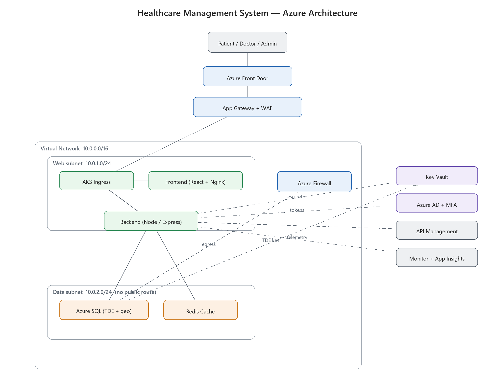

# Healthcare Management System — Capstone Report

**Course:** Cloud Architecture & Azure Deployment
**Author:** Vikas Singh
**Date:** June 2026

---

## 1. Overview

This project is a Healthcare Management System: a web application where patients, doctors and administrators each work with the same patient data, but only the parts they're allowed to see. I built it to run as a real, working app, and I designed the full Azure deployment around it.

I want to set expectations honestly at the start. I built and tested the application properly — there's a Node/Express API, a React front end, a real database, and a suite of tests that pass. For the Azure side I wrote the infrastructure-as-code (Terraform and Kubernetes manifests) and ran the cheaper parts, but I deliberately did *not* leave the heavy enterprise services (Azure Firewall, DDoS Standard) running on a student subscription. I've tried to be clear throughout about what I actually deployed versus what the design specifies but I didn't stand up in full.

### 1.1 The problem

Healthcare data is some of the most sensitive data there is, and the rules around it are strict. A system handling it has to deal with a handful of hard problems at once:

- Patient records must be encrypted and access-controlled — a receptionist shouldn't see what a doctor sees, and one patient must never see another's file.
- Patients, doctors and admins need genuinely different workflows over shared data.
- It has to satisfy HIPAA (US) and GDPR (EU), which means audit trails, encryption, and giving people access to their own data.
- It can't go down — a hospital losing its records system is a real safety problem, not just an inconvenience.
- Load isn't steady, so it has to scale up under pressure and back down to control cost.

No single server gives you all of that, which is the reason the design leans on cloud services.

### 1.2 Users and roles

| Role | What they can do |
|---|---|
| Patient | Register, book and cancel appointments, view their own records and prescriptions |
| Doctor | View their patients, run consultations, write health records, issue prescriptions |
| Admin | Manage user accounts and roles, deactivate users, review the audit log |

### 1.3 Features

| Feature | Notes |
|---|---|
| Accounts & login | bcrypt-hashed passwords, JWT sessions |
| Appointment scheduling | Booking with clash detection, status workflow |
| Electronic Health Records | Doctor-authored, patient-readable for their own records only |
| Prescriptions | Issued digitally by doctors, listed for the patient |
| Admin panel | User and role management |
| Audit log | Every login and record access recorded for compliance |

---

## 2. Architecture



The full architecture, the request flow and the reasoning behind each Azure service are in `architecture.md`. The short version: it's a three-tier app (React, Node API, SQL) sitting inside an Azure virtual network that's split into a public-facing web subnet and a locked-down data subnet, with WAF, identity, secrets management and monitoring wrapped around it.

The one design decision worth repeating here is the network boundary: the data subnet has no public route. The database can only be reached from the web subnet, enforced by network security group rules. So the database isn't just password-protected, it's not addressable from the internet at all.

---

## 3. Networking

The networking layer is built in `terraform/networking.tf`.

- **Virtual Network** `10.0.0.0/16`, carved into subnets so traffic can be controlled between tiers rather than treating the whole thing as one flat network.
- **Web subnet** `10.0.1.0/24` holds the AKS ingress and the application pods.
- **Data subnet** `10.0.2.0/24` holds Azure SQL and Redis, with NSG rules that accept connections only from the web subnet.
- **Application Gateway with WAF** is the layer-7 entry point. The WAF runs the OWASP rule set, so injection and scripting attacks are filtered before they reach the app.
- **Azure Firewall** controls outbound traffic for the whole VNet. For a small deployment it's the first thing I'd treat as optional, since NSGs plus the WAF already cover most of the same ground.
- **Front Door** is the global entry point and is what makes regional failover possible.
- **DDoS Protection** — Basic is free and always on; Standard is priced but not run.

---

## 4. Identity and access management

Identity is handled in two layers, and keeping them separate matters.

**Authentication** answers "who are you". The app checks the password against a bcrypt hash and, on success, issues a JWT that encodes the user's id and role. Doctors and admins additionally have MFA enforced through Azure AD Conditional Access — the higher-risk accounts get the stronger login. Patients can authenticate via OAuth2 / OpenID Connect.

**Authorization** answers "are you allowed to do this", and it's enforced server-side, every time. There's a role check on the route, and a finer-grained permission map (`backend/src/middleware/rbac.js`) that lists which roles can perform which actions. Crucially, ownership is enforced in the query itself — when a patient asks for "their" records, the query is scoped to their own id, so changing an id in the request gets them a 403, not someone else's data. The test suite proves this with explicit negative cases.

---

## 5. Security and compliance

**Encryption at rest** — Azure SQL Transparent Data Encryption with a customer-managed key stored in Key Vault. The data files are AES-256 encrypted and the key lives outside the database.

**Encryption in transit** — TLS 1.2 or higher everywhere, with HSTS set by the app (via Helmet) so browsers won't silently downgrade.

**Secrets** — database credentials and the JWT signing key are in Key Vault, never in source control or plain environment variables. The application reads them at startup.

**API protection** — Azure API Management fronts the API in production for throttling and a consistent auth gate. Locally I reproduce the parts that matter for behaviour — rate limiting and security headers — directly in Express.

**Compliance** — I'm careful here: I'm demonstrating the *technical controls* HIPAA and GDPR require, not claiming a certification (that's an organisational process). Concretely: audit logging of every access, encryption at rest and in transit, role-based access control, and a data model that supports a patient seeing and deleting their own data.

---

## 6. Containerisation and deployment

Both services are containerised with multi-stage Dockerfiles, so the runtime images stay small. Images are stored in Azure Container Registry and run on Azure Kubernetes Service.

The Kubernetes manifests (`kubernetes/`) run at least two replicas of each service for redundancy, expose them through an ingress wired to the Application Gateway, and include a horizontal pod autoscaler. Deployment is automated: the GitHub Actions pipeline (`.github/workflows/ci-cd.yml`) runs the tests on every push, and only builds, pushes and rolls out to AKS if those tests pass — so a broken commit can't reach the cluster.

---

## 7. Performance and monitoring

- **Monitoring**: Azure Monitor and Log Analytics for infrastructure, Application Insights inside the app for request latency, failure rates and dependency mapping.
- **Caching**: Redis holds session data and the read-heavy queries (a doctor's appointment list, for instance), so they don't hit SQL on every request.
- **Database tuning**: indexes on the foreign-key columns (patient_id, doctor_id) keep lookups fast as tables grow.
- **Autoscaling**: the HPA adds backend pods above ~70% CPU and removes them when load falls; the cluster autoscaler does the same with nodes. Peak hours get capacity automatically, quiet hours scale down to save money.

---

## 8. Database and data management

The schema (`backend/src/database.js`) has five tables: users, appointments, ehr_records, prescriptions, and audit_logs. Foreign keys tie records back to patients and doctors, and CHECK constraints keep roles and statuses to valid values.

In production this maps to Azure SQL with TDE for encryption at rest, geo-replication to a second region for disaster recovery, and automated backups. Locally the same schema runs on SQLite so the app is demoable with no cloud dependency. The data-access code is isolated in one module (`backend/src/database.js`), so moving to Azure SQL is contained to that file — swap the `better-sqlite3` driver for an mssql one and read the connection string from Key Vault. It's not zero work, but the routes and business logic don't change.

---

## 9. Governance

Governance is enforced mostly through Azure Policy (`terraform/security.tf`). Policy assignments block anyone — including future-me — from creating resources outside the allowed regions or above an allowed SKU size, and they require TDE on SQL and soft-delete on Key Vault, so the compliance controls can't be quietly turned off later. Every resource is tagged (`env`, `owner`) so ownership is never ambiguous, and RBAC on the resource group keeps who-can-touch-what tight. Azure Advisor is worth a periodic look too — it surfaces reliability and security improvements the design might have missed.

---

## 10. Key functionality as pseudo-code

The brief asks for pseudo-code for the important bits, so here are the three pieces of logic that carry the most weight.

**Login**

```
function login(email, password):
    user = db.findUserByEmail(email)
    if user is null or user.is_active is false:
        return 401 "Invalid credentials"      # same message either way, don't leak which

    if not bcrypt.compare(password, user.password_hash):
        audit.log(user.id, "LOGIN_FAILED")
        return 401 "Invalid credentials"

    token = jwt.sign({ id: user.id, role: user.role }, secret, expiresIn = 8h)
    audit.log(user.id, "LOGIN")
    return 200 { token, user }
```

**Authorisation check on every protected request**

```
function authorise(request, requiredPermission):
    token = readBearerToken(request)
    claims = jwt.verify(token, secret)         # throws -> 401 if bad or expired

    if requiredPermission not allowed for claims.role:
        return 403 "Permission denied"

    request.user = claims
    continue
```

**Reading a patient's own EHR (ownership enforced in the query)**

```
function getMyRecords(request):
    user = request.user
    if user.role == PATIENT:
        # scoped to the caller — they cannot ask for anyone else's id
        records = db.query("SELECT * FROM ehr_records WHERE patient_id = ?", user.id)
    else if user.role == DOCTOR:
        records = db.query("SELECT * FROM ehr_records WHERE doctor_id = ?", user.id)
    audit.log(user.id, "READ_EHR")
    return 200 records
```

**Booking an appointment with clash detection**

```
function bookAppointment(patientId, doctorId, when, durationMins):
    clash = db.query(
        "SELECT 1 FROM appointments
         WHERE doctor_id = ? AND status != 'CANCELLED'
         AND overlaps(appointment_date, duration_minutes, when, durationMins)",
        doctorId)
    if clash exists:
        return 409 "That slot is already taken"
    db.insert(appointments, { patientId, doctorId, when, durationMins, status: 'SCHEDULED' })
    return 201
```

---

## 11. Challenges and what I'd do next

The biggest challenge was getting the access-control model right and being able to *prove* it. Bolting a role check onto a route is easy; the hard part is guaranteeing that a patient can't reach another patient's record by tampering with an id in the request. The fix was to scope ownership in the query itself rather than trusting anything the client sends, and then to back that up with explicit negative tests — a patient gets a 403, not somebody else's data — so the guarantee is checked on every run instead of just assumed.

The second was keeping the local and cloud versions as the *same code*. Isolating the data layer behind one module is what made that possible — the app doesn't know or care whether it's talking to SQLite or Azure SQL.

If I took this further: real OAuth integration tests rather than simulated auth, a load test to actually validate the autoscaling under pressure (right now I can describe it but I haven't pushed traffic at it), and patient-facing GDPR self-service (download and delete my data) wired up end to end rather than just supported by the schema.

---

## Appendix — running it

See `README.md`. In short: `docker-compose up --build`, open http://localhost:3000, log in as `patient1@example.com / Patient@1234`. Tests: `cd backend && npm test` (19 tests).
